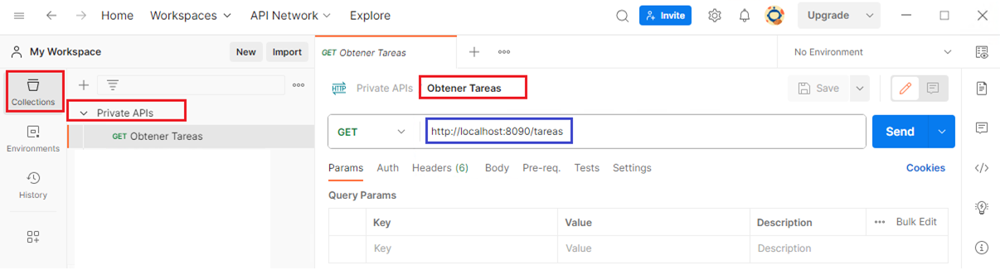

# Solicitudes GET, POST, PUT, DELETE en Postman

1. URL a APIs públicas

   - [swagger/docs | Open Library](https://openlibrary.org/swagger/docs)

     - ISBNs:

       ```
       1500382426
       1400052181
       9639526266
       ```

     - Curl:

       ```
       curl -L -X 'GET'   'https://openlibrary.org/isbn/1500382426'   -H 'accept: application/json'
       ```

     - Postman:

       - Crear solicitud

       - En headers añadir: 

         clave: accept	-valor: application/json

   - http://api.open-notify.org/iss-now.json

     - curl 

       ```
       curl -X GET http://api.open-notify.org/iss-now.json
       ```

     - Postman

       -  Crear Solicitud

   - https://api.ipbase.com/v1/json/

     - curl 

       ```
       curl -X GET https://api.ipbase.com/v1/json/
       ```

     - Postamn
       - Crear Solicitud

2. URL Privada

   - Con el ejercicio de principios de diseño APIRestful del módulo 2-1 **Cap-2-1** `principiosDesignAPIRestful.py`

     ```bash
     py -m pip install --upgrade pip
     pip install fastapi pydantic starlette uvicorn
     ```

   - Ejecutar en el entorno virtual

     ```
     py principiosDesignAPIRestful.py
     ```

     - Realizar GET, PUT, DELETE, POST

     - curl **GET**

       ```
       curl -X 'GET' 'http://localhost:8090/tareas' -H 'accept: application/json'

     - postman

       

     - Curl **POST**

       ```
       curl -L -X 'POST' 'http://localhost:8090/tareas' -H 'accept: application/json' -H 'Content-Type: application/json' -d '{  "nombre": "Tarea01",  "completada": true,  "links": {}}'
       ```

     - postman

       

     - Curl **GET by ID**

       ```
       curl -X 'GET'  'http://localhost:8090/tareas/0'  -H 'accept: application/json'
       ```

     - postman

       

     - Curl **PUT**

       ```
       curl -X 'PUT'  'http://localhost:8090/tareas/0'  -H 'accept: application/json'  -H 'Content-Type: application/json'  -d '{ "nombre": "Tarea Uno actualizada", "completada": true, "links": {}}'
       ```

     - postman

       

     - Curl **DELETE**

       ```
       curl -X 'DELETE'  'http://localhost:8090/tareas/0'  -H 'accept: application/json'
       ```

     - postman

       