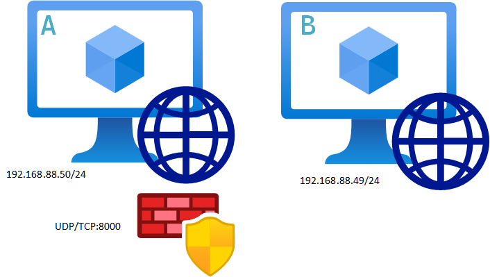
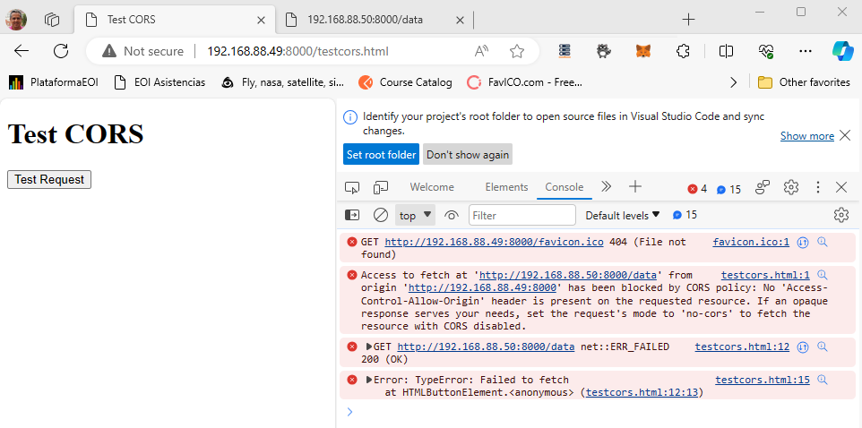
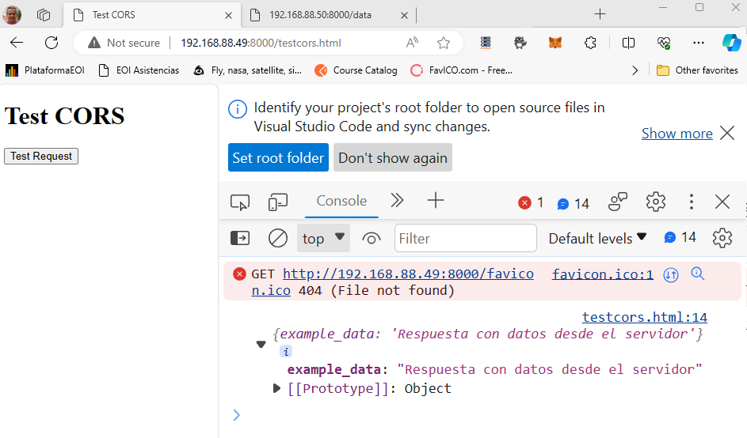

#  CORS (Cross-Origin Resource Sharing)

```


```

## Escenario



####  Servidor A

- Apertura de puertos

  ```powershell
  netsh advfirewall firewall add rule name="Open Port 8000" dir=in action=allow protocol=TCP localport=8000
  ```

  > Nota: Al finalizar la práctica recuerda quitar la apertura si no la vas a utilizar:
  >
  > ```powershell
  > netsh advfirewall firewall delete rule name="Open Port 8000"
  > ```

  Verifica la regla si esta correctamente creada o si ha quedado quitada:

  ```powershell
  netsh advfirewall firewall show rule name="Open Port 8000"
  ```

- Creación de script FastApi con CORS

  Instalación de entorno, activación y librerias inciales

  ```powershell
  py -3.9 -m venv env
  .\env\Scripts\activate.ps1
  py -m pip install --upgrade pip
  pip install fastapi
  ```

  Programa con código CORs

  ```python
  from fastapi import FastAPI, Request
  from fastapi.middleware.cors import CORSMiddleware
  
  app = FastAPI()
  
  # CORS
  origins = [
      "http://localhost:8000",
      "http://localhost",
      "http://yourdomain.com",
      "https://your_frontend_domain.com",
      "http://your_frontend_domain.net"
  ]
  app.add_middleware(
      CORSMiddleware,
      allow_origins=origins,
      allow_credentials=True,
      allow_methods=["*"],
      allow_headers=["*"]
  )
  
  @app.middleware("http")
  async def add_cors_header(request: Request, call_next):
      response = await call_next(request)
      request_origin = request.headers.get('Origin')
      print(request_origin)
      if request_origin in origins:
          response.headers['Access-Control-Allow-Origin'] = request_origin
      response.headers['Access-Control-Allow-Headers'] = '*'
      response.headers['Access-Control-Allow-Methods'] = '*'
      return response
  #Rutas de ejemplo
  @app.get("/")
  def read_root():
      return {"message": "Respuesta desde el servidor"}
  
  @app.get("/data")
  def read_data():
      data={"example_data": "Respuesta con datos desde el servidor"}
      return data
  
  if __name__ == "__main__":
      import uvicorn
      uvicorn.run(app, host="192.168.88.50", port=8000)
  ```

#### Servidor B

- Copiamos la página web de prueba `testcors.html`

  ```html
  <!DOCTYPE html>
  <html>
  <head>
      <title>Test CORS</title>
  </head>
  <body>
      <h1>Test CORS</h1>
      <button id="testButton">Test Request</button>
  
      <script>
          document.getElementById('testButton').addEventListener('click', function() {
              fetch('http://192.168.88.50:8000/data')
                  .then(response => response.json())
                  .then(data => console.log(data))
                  .catch(error => console.error('Error:', error));
          });
      </script>
  </body>
  </html>
  ```

- Ejecución del Servidor Web con Python `SimpleHTTPServer`

  ```powershell
  python -m http.server
  ```

  Esto es suficiente para servir la página HTML de prueba y realizar solicitudes CORS desde el navegador.

  

- Abrir un navegador y seleccionar `http://localhost:8000`

  Deberá aparecer la página web de prueba asi:

  

  ```bash
  Access to fetch at 'http://192.168.88.50:8000/data' from origin 'http://192.168.88.49:8000' has been blocked by CORS policy: No 'Access-Control-Allow-Origin' header is present on the requested resource. If an opaque response serves your needs, set the request's mode to 'no-cors' to fetch the resource with CORS disabled.
  ```

#### Servidor A

- Añadir la dirección y el puerto `192.168.88.49:8000`

  ```python
  # CORS
  origins = [
      "http://localhost:8000",
      "http://localhost",
      "http://yourdomain.com",
      "https://your_frontend_domain.com",
      "http://your_frontend_domain.net",
      "http://192.168.88.49:8000"
  ]
  ```

- Reiniciar el servidor

  ```
  py .\main.py
  ```

#### Servidor B

- Volver a navegar desde la página web refrescando `CTRL+R` a la dirección 

  `http://192.168.49:8000/testcors.html`

  


## Conclusiones

1. Características de CORS en el **Servidor A**
   En este servidor, se ha configurado CORS para permitir solicitudes desde varios orígenes (`allow_origins`). También has configurado otros aspectos de CORS, como permitir credenciales (`allow_credentials`), permitir cualquier método HTTP (`allow_methods`), y permitir cualquier encabezado (`allow_headers`).
   Además, se ha agregado un middleware personalizado (`add_cors_header`) para asegurarse de que los encabezados CORS se manejen adecuadamente.

2. Configuración del **Servidor A** con `uvicorn`

   En este servidor se has utilizado `uvicorn` para ejecutar la aplicación FastAPI. Esto es común durante el desarrollo para facilitar la recarga automática y la depuración. Sin embargo, en producción, se recomienda utilizar un servidor como Gunicorn junto con un servidor proxy como Nginx o Apache.

3. Creación de una Página HTML para Pruebas en el **Servidor B**

   En este servidor se ha creado una página HTML simple que realiza una solicitud a la API en el **Servidor B** . La configuración CORS adecuada en el **Servidor A** permite que esta solicitud se realice con éxito desde un dominio diferente.

4. Recomendaciones para Producción

   En producción, es esencial asegurarse de que la configuración de CORS sea segura y restrinja adecuadamente los orígenes permitidos. No se recomienda permitir cualquier origen (*) a menos que sea estrictamente necesario. Es preferible especificar orígenes permitidos explícitamente.

   Se recomienda configurar un servidor de producción robusto como Gunicorn y utilizar un servidor proxy (por ejemplo, Nginx o Apache) delante de laaplicación FastAPI para manejar tareas como la gestión de múltiples instancias, el equilibrio de carga y la gestión de solicitudes estáticas.

   Se recomienda considera el uso de HTTPS en producción para garantizar la seguridad de las comunicaciones entre el cliente y el servidor.

5. Solicitudes desde una API REST y Postman

   Cuando se realizan solicitudes desde una API REST, se debe asegurar de que los encabezados CORS necesarios se incluyan en las respuestas. Esto es importante si se esta consumiendo la API desde una aplicación web en un dominio diferente.

6. Durante el desarrollo al usar Postman, no hay que preocuparte por CORS, ya que Postman no está sujeto a las restricciones CORS. Se puedes realizar solicitudes directas a la API sin problemas.

   

